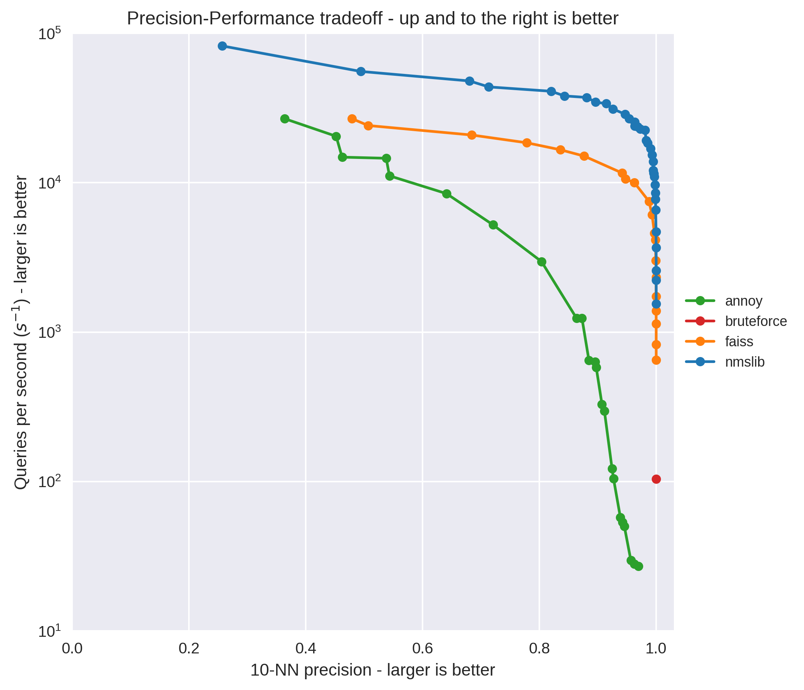

# Результаты эксперементов

### Схема работы:
1) Спаршенная база вакансий и резюме с hh предварительно обрабатывается, чистится, нормализуется, токенезируется, кодируется в эмбеддинги. При этом важно кодировать вакансии и резюме в единое векторное простнаство, что бы моэно было сравнивать между собой и искать близкие вектора.
2) Полученные от юзера текстовые данные кодируются в эмбеддинг
3) Для данного эмбеддинга ищем ему ближайшие топ _n_ векторов вакансий/резюме и берем их _id_.
4) Из базы данных, хранящей полные и человекочитаемые описания вакансий/резюме получаем нужные записи по полученным выше _id_.
5) Полученные записи сортируем по релевантности, то есть по искоммоу городу, по разнице между запрашиваемой зарплатой и зп в описании, по требуемому опыту

Поиск ближайших векторов осуществляется с помощью ANN(Approximate Nearest Neighbours), что дает сопоставимый по точности, но значитаельно более быстрый результат, чем KNN.

Сравнив несколько библиотек(на картинке ниже) выбор пал на `nmslib` (bruteforce на графике - это классический KNN).

### Гипотеза 1 - Использование трансформеров

Трансформеры позволяют наиболее эффективно кодировать в эмбеддинги текстовые данные. Для нашей задачи мы взяли облегченную версию `rubert-tiny-2`, обученную на корпусе русских слов. Из минусов - необходимость использования гпу для более быстрой работы.

### Гипотеза 2 - Использование bag-of-words
Идея заключатеся в кодировании текста с помощью вектора размерности словаря, где на соответствующих позициях стоят числа, обозначающие сколько раз это слово встретилось в тексте. Подход достаточно простой и может быть эффективным.

Однако серьезным недостатоком является использование разряженных векторов большой размерности (десятки и сотни тысяч). Также этот способ не учитывает смысл слова, только его часоту.

Способ не получилось применить, так как библиотеки ANN не все умеют работать с разряженными матрицами, или работают с ними оцень плохо, в то время как использование плотных матриц не возможно технически (требуется > 246 GB памяти).

### Скорость выполнения:

На цпу и на гпу разница между временем выполнения запроса небольшая: 0.8 vs 0.93 секунд в среднем. Так как данные в трансформер подаются не батчами, а по одному, то все плюсы работы на гпу сводятся к минимуму.

При этом разница во времени работы между режимами подбора вакансий и подбором резюме достаточно заметная:
   * 0.65 сек для резюме
   * 1.11 сек для вакансий.

Это связано с разным размером базы:
   * 44744 резюме,
   * 140197 вакансий.